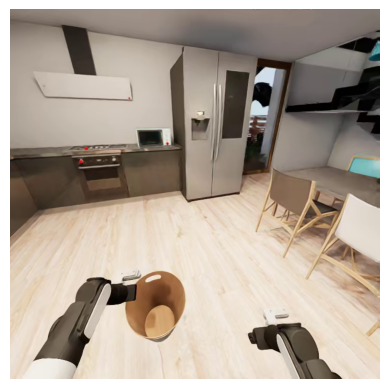
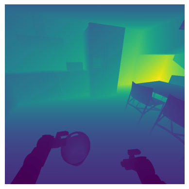
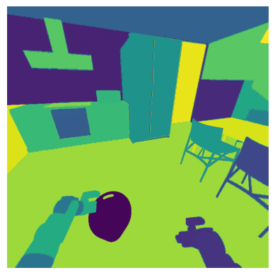

# Dataset

**NOTE: The [joint efforts data](https://github.com/StanfordVL/BEHAVIOR-1K/blob/main/OmniGibson/omnigibson/learning/utils/eval_utils.py#L90) in the robot state entry of the parquet files are wrong. This is because we do not store observations during our initial data collection, and all observations are collected through a round of "data replay" in which we restore sim state every step without stepping physics, and thus the joint effort reading is wrong. Please do not use them for training. They will be removed in the next dataset release.**

## Dataset Access

We host our dataset on Hugging Face:

**Dataset URL**: [https://huggingface.co/datasets/behavior-1k/2025-challenge-demos](https://huggingface.co/datasets/behavior-1k/2025-challenge-demos)

**Rawdata URL**: [https://huggingface.co/datasets/behavior-1k/2025-challenge-rawdata](https://huggingface.co/datasets/behavior-1k/2025-challenge-rawdata)

## Data Format

For the 2025 NeurIPS challenge, we provide the following datasets:

1. [2025-challenge-demos](https://huggingface.co/datasets/behavior-1k/2025-challenge-demos): 10000 human-collected teleoperation demos across 50 tasks. It follows the [LeRobot](https://huggingface.co/lerobot) format with some customizations for better data handling. The dataset has the following structure:

    | Folder       | Description                                                                  |
    |--------------|------------------------------------------------------------------------------|
    | annotations  | language annotations for each episode                                        |
    | data         | low dim data, including proprioceptions, actions, privileged task info, etc. |
    | meta         | metadata folder containing episode-level information                         |
    | videos       | visual observations, including rgb, depth, seg_instance_id                   |

2. [2025-challenge-rawdata](https://huggingface.co/datasets/behavior-1k/2025-challenge-rawdata): the original raw HDF5 data of the 10k teleoperation demos. These files contains everything needed to replay the exact trajectory in OmniGibson. We use this alongside with `OmniGibson/scripts/replay_obs.py` to replay the trajectory and collect additional visual observations.

Our demonstration data ([2025-challenge-demos](https://huggingface.co/datasets/behavior-1k/2025-challenge-demos)) is provided in **LeRobot format**, a widely-adopted format for robot learning datasets. LeRobot provides a unified interface for robot demonstration data, making it easy to load, process, and use the data for training policies. 

To learn more about the LeRobot format, visit the official [LeRobot repository](https://github.com/huggingface/lerobot). The whole dataset is ~1.5T, and <u>we provide APIs to perform partial downloads based on task name, cameras, and modalities</u>. We also provide functions to generate new modalities based on what's given by the dataset. Please refer to our tutorial notebooks about [loading the dataset](https://github.com/StanfordVL/b1k-baselines/blob/main/tutorials/dataset.ipynb) and [generating custom data](https://github.com/StanfordVL/b1k-baselines/blob/main/tutorials/generate_custom_data.ipynb).

The dataset includes 3 visual modalities: RGB (rgb), Depth (depth_linear), and Mesh Segmentation (seg_instance_id):

<table markdown="span">
    <tr>
        <td valign="top" width="60%">
            <strong>RGB</strong>    
            RGB image of the scene from the camera perspective.   
            Size: (height, width, 4), numpy.uint8  
            Resolution: 720 x 720 for head camera, 480 x 480 for wrist cameras. Range: [0, 255]   
            We provide [RGBVideoLoader](https://github.com/StanfordVL/BEHAVIOR-1K/blob/main/OmniGibson/omnigibson/learning/utils/obs_utils.py#L315-L330) class for loading RGB mp4 video from demo dataset.   
        </td>
        <td>
            
        </td>
    </tr>
    <tr>
        <td valign="top" width="60%">
            <strong>Depth Linear</strong>    
            Distance between the camera and everything else in the scene, where distance measurement is linearly proportional to the actual distance.  
            Size: (height, width), numpy.float32  
            During data replay, we converted raw depth data to mp4 videos through a log quantization step. Our provided data loader will dequantize the video, and return (unnormalized) depth value within the range of [0, 10] meters.  
            Please checkout [quantize_depth](https://github.com/StanfordVL/BEHAVIOR-1K/blob/main/OmniGibson/omnigibson/learning/utils/obs_utils.py#L41-L63) and [dequantize_depth](https://github.com/StanfordVL/BEHAVIOR-1K/blob/main/OmniGibson/omnigibson/learning/utils/obs_utils.py#L66-L88) for more details.   
            We provide [DepthVideoLoader](https://github.com/StanfordVL/BEHAVIOR-1K/blob/main/OmniGibson/omnigibson/learning/utils/obs_utils.py#L333-L351) class for loading depth mp4 video from demo dataset.   
        </td>
        <td>
            
        </td>
    </tr>
    <tr>
        <td valign="top" width="60%">
            <strong>Instance Segmentation ID</strong>    
            Each pixel is assigned a label, indicating the specific object instance it belongs to (e.g., /World/table1/visuals, /World/chair2/visuals).  
            Size: (height, width), numpy.uint32  
            Each integer corresponds to a unique instance id of a mesh, the id to prim path mapping can be found as `ins_id_mapping` in the [episode metadata json file](https://huggingface.co/datasets/behavior-1k/2025-challenge-demos/tree/main/meta/episodes).   
            We provide [SegVideoLoader](https://github.com/StanfordVL/BEHAVIOR-1K/blob/main/OmniGibson/omnigibson/learning/utils/obs_utils.py#L354-L375) class for loading mesh segmentation mp4 video from demo dataset.   
        </td>
        <td>
            
        </td>
    </tr>
</table>

## Dataset Statistics

| Metric | Value |
| ------ | ----- |
| Total Trajectories | 10,000 |
| Total Tasks | 50 |
| Total Skills | 270,600 |
| Unique Skills | 31 |
| Avg. Skills per Trajectory | 27.06 |
| Avg. Trajectory Duration | 397.04 seconds / 6.6 minutes |

<b>Show unique skills breakdown</b>

<ul>
<li>attach</li>
<li>chop</li>
<li>close door</li>
<li>close drawer</li>
<li>close lid</li>
<li>hand over</li>
<li>hang</li>
<li>hold</li>
<li>ignite</li>
<li>insert</li>
<li>move to</li>
<li>open door</li>
<li>open drawer</li>
<li>open lid</li>
<li>pick up from</li>
<li>place in</li>
<li>place in next to</li>
<li>place on</li>
<li>place on next to</li>
<li>place under</li>
<li>pour</li>
<li>press</li>
<li>push to</li>
<li>release</li>
<li>spray</li>
<li>sweep surface</li>
<li>tip over</li>
<li>turn off switch</li>
<li>turn on switch</li>
<li>turn to</li>
<li>wipe hard</li>
</ul>

### Overall Demo Duration

### Per Task Demo Duration

